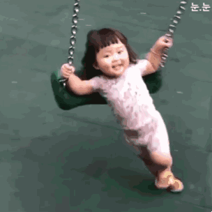

Dear Lorrie,

\"Just another boring night, nothing special will happen.\" I said to myself. I looked up at the sky, couldn’t see any stars. I clicked the confirm button and sent my request to you. Then everything started to change.

As the wind blew, I saw something bright was hidden behind the clouds. It shines a shaft of light on me. I was there, standing still, staring at it. People nearby walked in and walked out, no one noticed it. Just like it only shines on me. My own light.

That’s how our story began.

Time flies, we’ve been together for about four months. And I still have no idea why you chose me but I prefer to trust you.

Love should be more profound. Loving and being loved are not easy things. The sun burns you skin, while the starlight is too faint. You’re my moonlight, you are bright but not hurting and you guide me in the dark.

To you, I may haven’t left any touching moments. I’ve never saved or comforted you from bullying. I’ve never ridden bikes with you. I’ve never taken you to an underground band either. I wish I was there. I wish I could know you earlier. And I wish I could have everything you want. I wish I was perfect.

~~I think I may be the most unsatisfying boyfriend in your all relationships. Maybe it’s because I’m poor or something else, or maybe just nothing’s right at all. I don’t feel a thing any more.~~

~~I don’t talk much any more. I’m sure it’s not the problem of the topics. You can talk to others with the same topic happily. I can do that with my friends too. But when I talk to you, we can’t continue any of them. You interrupted me or just stopped talking every time. I don’t think I am a boring guy. You’ll laugh out loud by some more boring topics from your friends.~~

~~It was me that you are just not that into. That’s why I feel unsafe and unwanted. And that’s why I always have an unhappy face.~~

~~You always say that you feel safe with me, you can say whatever you want. But I’m not allowed to do that. Every time when I express myself, you get mad and tell me to breakup.~~

~~I don’t even crave you love now. I don’t crave things not belong to me. I can only write it down, I bet you won’t read this.~~

I DO LOVE YOU.

Woody Wang

Jul 8, 2019

> The deleted paragraphs were hidden on the original website. I unhided it here just wanted you to know how I really felt at that time.
